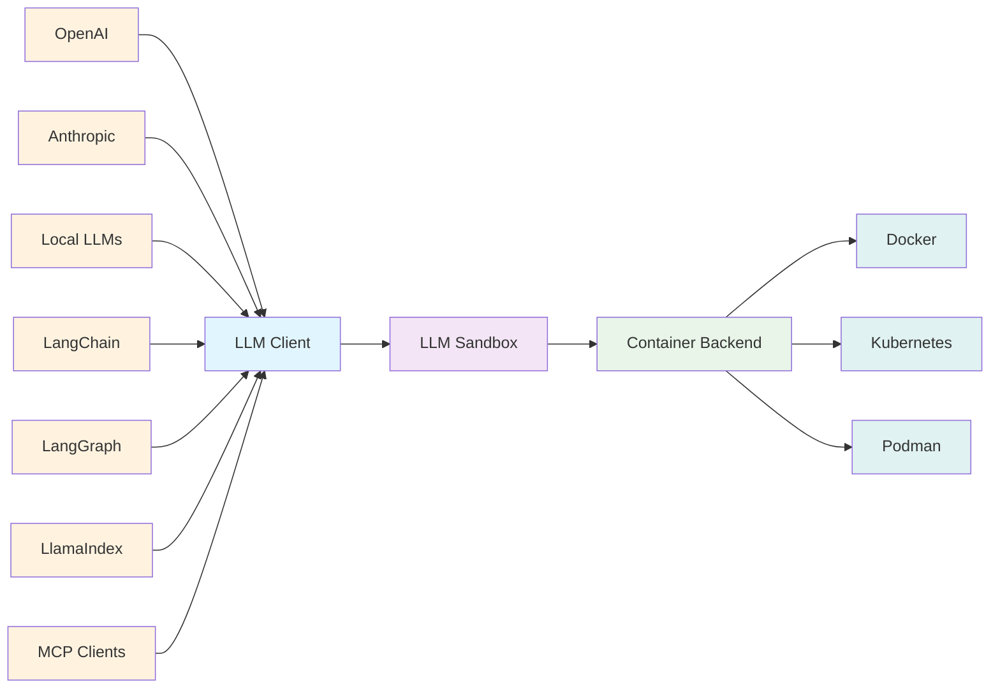

## LLM Sandbox

*Securely Execute LLM-Generated Code with Ease*

[](https://sonarcloud.io/summary/new_code?id=vndee_llm-sandbox)

[](https://sonarcloud.io/summary/new_code?id=vndee_llm-sandbox)
[](https://pypi.org/project/llm-sandbox/)
[](https://img.shields.io/github/v/release/vndee/llm-sandbox)
[](https://github.com/vndee/llm-sandbox/actions/workflows/main.yml?query=branch%3Amain)
[](https://www.codefactor.io/repository/github/vndee/llm-sandbox)
[](https://codecov.io/gh/vndee/llm-sandbox)


**LLM Sandbox** is a lightweight and portable sandbox environment designed to run Large Language Model (LLM) generated code in a safe and isolated mode. It provides a secure execution environment for AI-generated code while offering flexibility in container backends and comprehensive language support, simplifying the process of running code generated by LLMs.

Documentation: https://vndee.github.io/llm-sandbox/


✨ **New:** This project now supports the [Model Context Protocol (MCP)](https://vndee.github.io/llm-sandbox/mcp-integration/) server, which allows your MCP clients (e.g. Claude Desktop) to run code generated by LLMs in a secure sandbox environment.

## 🚀 Key Features

### 🛡️ Security First
- **Isolated Execution**: Code runs in isolated containers with no access to host system
- **Security Policies**: Define custom security policies to control code execution
- **Resource Limits**: Set CPU, memory, and execution time limits
- **Network Isolation**: Control network access for sandboxed code

### 🏗️ Flexible Container Backends
- **Docker**: Most popular and widely supported option
- **Kubernetes**: Enterprise-grade orchestration for scalable deployments
- **Podman**: Rootless containers for enhanced security

### 🌐 Multi-Language Support
Execute code in multiple programming languages with automatic dependency management:
- **Python** - Full ecosystem support with pip packages
- **JavaScript/Node.js** - npm package installation
- **Java** - Maven and Gradle dependency management
- **C++** - Compilation and execution
- **Go** - Module support and compilation
- **R** - Statistical computing and data analysis with CRAN packages

### 🔌 LLM Framework Integration
Seamlessly integrate with popular LLM frameworks such as LangChain, LangGraph, LlamaIndex, OpenAI, and more.

### 📊 Advanced Features
- **Artifact Extraction**: Automatically capture plots and visualizations
- **Library Management**: Install dependencies on-the-fly
- **File Operations**: Copy files to/from sandbox environments
- **Custom Images**: Use your own container images

## 📦 Installation

### Basic Installation
```bash
pip install llm-sandbox
```

### With Specific Backend Support
```bash
# For Docker support (most common)
pip install 'llm-sandbox[docker]'

# For Kubernetes support
pip install 'llm-sandbox[k8s]'

# For Podman support
pip install 'llm-sandbox[podman]'

# All backends
pip install 'llm-sandbox[docker,k8s,podman]'
```

### Development Installation
```bash
git clone https://github.com/vndee/llm-sandbox.git
cd llm-sandbox
pip install -e '.[dev]'
```

## 🏃‍♂️ Quick Start

### Basic Usage

```python
from llm_sandbox import SandboxSession

# Create and use a sandbox session
with SandboxSession(lang="python") as session:
    result = session.run("""
print("Hello from LLM Sandbox!")
print("I'm running in a secure container.")
    """)
    print(result.stdout)
```

### Installing Libraries

```python
from llm_sandbox import SandboxSession

with SandboxSession(lang="python") as session:
    result = session.run("""
import numpy as np

# Create an array
arr = np.array([1, 2, 3, 4, 5])
print(f"Array: {arr}")
print(f"Mean: {np.mean(arr)}")
    """, libraries=["numpy"])

    print(result.stdout)
```

### Multi-Language Support

#### JavaScript
```python
with SandboxSession(lang="javascript") as session:
    result = session.run("""
const greeting = "Hello from Node.js!";
console.log(greeting);

const axios = require('axios');
console.log("Axios loaded successfully!");
    """, libraries=["axios"])
```

#### Java
```python
with SandboxSession(lang="java") as session:
    result = session.run("""
public class HelloWorld {
    public static void main(String[] args) {
        System.out.println("Hello from Java!");
    }
}
    """)
```

#### C++
```python
with SandboxSession(lang="cpp") as session:
    result = session.run("""
#include <iostream>

int main() {
    std::cout << "Hello from C++!" << std::endl;
    return 0;
}
    """)
```

#### Go
```python
with SandboxSession(lang="go") as session:
    result = session.run("""
package main
import "fmt"

func main() {
    fmt.Println("Hello from Go!")
}
    """)
```

#### R
```python
with SandboxSession(
    lang="r",
    image="ghcr.io/vndee/sandbox-r-451-bullseye",
    verbose=True,
) as session:
    result = session.run(
        """
# Basic R operations
print("=== Basic R Demo ===")

# Create some data
numbers <- c(1, 2, 3, 4, 5, 10, 15, 20)
print(paste("Numbers:", paste(numbers, collapse=", ")))

# Basic statistics
print(paste("Mean:", mean(numbers)))
print(paste("Median:", median(numbers)))
print(paste("Standard Deviation:", sd(numbers)))

# Work with data frames
df <- data.frame(
    name = c("Alice", "Bob", "Charlie", "Diana"),
    age = c(25, 30, 35, 28),
    score = c(85, 92, 78, 96)
)

print("=== Data Frame ===")
print(df)

# Calculate average score
avg_score <- mean(df$score)
print(paste("Average Score:", avg_score))
        """
    )
```

### Capturing Plots and Visualizations

#### Python Plots
```python
from llm_sandbox import ArtifactSandboxSession
import base64
from pathlib import Path

with ArtifactSandboxSession(lang="python") as session:
    result = session.run("""
import matplotlib.pyplot as plt
import numpy as np

x = np.linspace(0, 10, 100)
y = np.sin(x)

plt.figure(figsize=(10, 6))
plt.plot(x, y)
plt.title("Sine Wave")
plt.xlabel("x")
plt.ylabel("sin(x)")
plt.grid(True)
plt.savefig("sine_wave.png", dpi=150, bbox_inches="tight")
plt.show()
    """, libraries=["matplotlib", "numpy"])

    # Extract the generated plots
    print(f"Generated {len(result.plots)} plots")

    # Save plots to files
    for i, plot in enumerate(result.plots):
        plot_path = Path(f"plot_{i + 1}.{plot.format.value}")
        with plot_path.open("wb") as f:
            f.write(base64.b64decode(plot.content_base64))
```

#### R Plots
```python
from llm_sandbox import ArtifactSandboxSession
import base64
from pathlib import Path

with ArtifactSandboxSession(lang="r") as session:
    result = session.run("""
library(ggplot2)

# Create sample data
data <- data.frame(
    x = rnorm(100),
    y = rnorm(100)
)

# Create ggplot2 visualization
p <- ggplot(data, aes(x = x, y = y)) +
    geom_point(alpha = 0.6) +
    geom_smooth(method = "lm", se = FALSE) +
    labs(title = "Scatter Plot with Trend Line",
         x = "X values", y = "Y values") +
    theme_minimal()

print(p)

# Base R plot
hist(data$x, main = "Distribution of X",
     xlab = "X values", col = "lightblue", breaks = 20)
    """, libraries=["ggplot2"])

    # Extract the generated plots
    print(f"Generated {len(result.plots)} R plots")

    # Save plots to files
    for i, plot in enumerate(result.plots):
        plot_path = Path(f"r_plot_{i + 1}.{plot.format.value}")
        with plot_path.open("wb") as f:
            f.write(base64.b64decode(plot.content_base64))
```

## 🔧 Configuration

### Basic Configuration

```python
from llm_sandbox import SandboxSession

# Create a new sandbox session
with SandboxSession(image="python:3.9.19-bullseye", keep_template=True, lang="python") as session:
    result = session.run("print('Hello, World!')")
    print(result)

# With custom Dockerfile
with SandboxSession(dockerfile="Dockerfile", keep_template=True, lang="python") as session:
    result = session.run("print('Hello, World!')")
    print(result)

# Or default image
with SandboxSession(lang="python", keep_template=True) as session:
    result = session.run("print('Hello, World!')")
    print(result)
```


LLM Sandbox also supports copying files between the host and the sandbox:

```python
from llm_sandbox import SandboxSession

with SandboxSession(lang="python", keep_template=True) as session:
    # Copy a file from the host to the sandbox
    session.copy_to_runtime("test.py", "/sandbox/test.py")

    # Run the copied Python code in the sandbox
    result = session.execute_command("python /sandbox/test.py")
    print(result)

    # Copy a file from the sandbox to the host
    session.copy_from_runtime("/sandbox/output.txt", "output.txt")
```

#### Custom runtime configs

```python
from llm_sandbox import SandboxSession

pod_manifest = {
    "apiVersion": "v1",
    "kind": "Pod",
    "metadata": {
        "name": "test",
        "namespace": "test",
        "labels": {"app": "sandbox"},
    },
    "spec": {
        "containers": [
            {
                "name": "sandbox-container",
                "image": "test",
                "tty": True,
                "volumeMounts": {
                    "name": "tmp",
                    "mountPath": "/tmp",
                },
            }
        ],
        "volumes": [{"name": "tmp", "emptyDir": {"sizeLimit": "5Gi"}}],
    },
}
with SandboxSession(
    backend="kubernetes",
    image="python:3.9.19-bullseye",
    dockerfile=None,
    lang="python",
    keep_template=False,
    verbose=False,
    pod_manifest=pod_manifest,
) as session:
    result = session.run("print('Hello, World!')")
    print(result)
```

#### Remote Docker Host

```python
import docker
from llm_sandbox import SandboxSession

tls_config = docker.tls.TLSConfig(
    client_cert=("path/to/cert.pem", "path/to/key.pem"),
    ca_cert="path/to/ca.pem",
    verify=True
)
docker_client = docker.DockerClient(base_url="tcp://<your_host>:<port>", tls=tls_config)

with SandboxSession(
    client=docker_client,
    image="python:3.9.19-bullseye",
    keep_template=True,
    lang="python",
) as session:
    result = session.run("print('Hello, World!')")
    print(result)
```

#### Kubernetes Support

```python
from kubernetes import client, config
from llm_sandbox import SandboxSession

# Use local kubeconfig
config.load_kube_config()
k8s_client = client.CoreV1Api()

with SandboxSession(
    client=k8s_client,
    backend="kubernetes",
    image="python:3.9.19-bullseye",
    lang="python",
    pod_manifest=pod_manifest, # None by default
) as session:
    result = session.run("print('Hello from Kubernetes!')")
    print(result)
```

#### Podman Support

```python
from llm_sandbox import SandboxSession

with SandboxSession(
    backend="podman",
    lang="python",
    image="python:3.9.19-bullseye"
) as session:
    result = session.run("print('Hello from Podman!')")
    print(result)
```

## 🤖 LLM Framework Integration

### LangChain Tool

```python
from langchain.tools import BaseTool
from llm_sandbox import SandboxSession

class PythonSandboxTool(BaseTool):
    name = "python_sandbox"
    description = "Execute Python code in a secure sandbox"

    def _run(self, code: str) -> str:
        with SandboxSession(lang="python") as session:
            result = session.run(code)
            return result.stdout if result.exit_code == 0 else result.stderr
```

### Use with OpenAI Functions

```python
import openai
from llm_sandbox import SandboxSession

def execute_code(code: str, language: str = "python") -> str:
    """Execute code in a secure sandbox environment."""
    with SandboxSession(lang=language) as session:
        result = session.run(code)
        return result.stdout if result.exit_code == 0 else result.stderr

# Register as OpenAI function
functions = [
    {
        "name": "execute_code",
        "description": "Execute code in a secure sandbox",
        "parameters": {
            "type": "object",
            "properties": {
                "code": {"type": "string", "description": "Code to execute"},
                "language": {"type": "string", "enum": ["python", "javascript", "java", "cpp", "go", "r"]}
            },
            "required": ["code"]
        }
    }
]
```

## 🔌 Model Context Protocol (MCP) Server

LLM Sandbox provides a [Model Context Protocol (MCP)](https://modelcontextprotocol.io/) server that enables AI assistants like Claude Desktop to execute code securely in sandboxed environments. This integration allows LLMs to run code directly with automatic visualization capture and multi-language support.

### Features

- **Secure Code Execution**: Execute code in isolated containers with your preferred backend
- **Multi-Language Support**: Run Python, JavaScript, Java, C++, Go, R, and Ruby code
- **Automatic Visualization Capture**: Automatically capture and return plots and visualizations
- **Library Management**: Install packages and dependencies on-the-fly
- **Flexible Backend Support**: Choose from Docker, Podman, or Kubernetes backends

### Installation

Install LLM Sandbox with MCP support using your preferred backend:

```bash
# For Docker backend
pip install 'llm-sandbox[mcp-docker]'

# For Podman backend
pip install 'llm-sandbox[mcp-podman]'

# For Kubernetes backend
pip install 'llm-sandbox[mcp-k8s]'
```

### Configuration

Add the following configuration to your MCP client (e.g., `claude_desktop_config.json` for Claude Desktop):

```json
{
  "mcpServers": {
    "llm-sandbox": {
      "command": "python3",
      "args": ["-m", "llm_sandbox.mcp_server.server"],
    }
  }
}
```

#### Backend-Specific Configuration

For the specific backend, you need to set the `BACKEND` environment variable to the backend you want to use. You might need to set other environment variables depending on the backend you are using. For example, you might need to set the `DOCKER_HOST` environment variable to the host you want to use if the `DOCKER_HOST` is not automatically in your system.

**Docker (default):**
```json
{
  "mcpServers": {
    "llm-sandbox": {
      "command": "python3",
      "args": ["-m", "llm_sandbox.mcp_server.server"],
      "env": {
        "BACKEND": "docker",
        "DOCKER_HOST": "unix:///var/run/docker.sock" // change this to the actual host you are using
      }
    }
  }
}
```

**Podman:**
```json
{
  "mcpServers": {
    "llm-sandbox": {
      "command": "python3",
      "args": ["-m", "llm_sandbox.mcp_server.server"],
      "env": {
        "BACKEND": "podman",
        "DOCKER_HOST": "unix:///var/run/podman/podman.sock" // change this to the actual host you are using
      }
    }
  }
}
```

For Kubernetes, you might need to set the `KUBECONFIG` environment variable to the path to your kubeconfig file.

**Kubernetes:**
```json
{
  "mcpServers": {
    "llm-sandbox": {
      "command": "python3",
      "args": ["-m", "llm_sandbox.mcp_server.server"],
      "env": {
        "BACKEND": "kubernetes",
        "KUBECONFIG": "/path/to/kubeconfig" // change this to the actual path to your kubeconfig file
      }
    }
  }
}
```

### Available Tools

The MCP server provides the following tools:

- **`execute_code`**: Execute code in a secure sandbox with automatic visualization capture
- **`get_supported_languages`**: Get the list of supported programming languages
- **`get_language_details`**: Get detailed information about a specific language

### Usage Example

Once configured, you can ask your AI assistant to run code, and it will automatically use the LLM Sandbox MCP server:

```text
"Create a scatter plot showing the relationship between x and y data points using matplotlib"
```

The assistant will execute Python code in a secure sandbox and automatically capture any generated plots or visualizations.

## 🏗️ Architecture



## 📚 Documentation

- **[Full Documentation](https://vndee.github.io/llm-sandbox/)** - Complete documentation
- **[Getting Started](https://vndee.github.io/llm-sandbox/getting-started/)** - Installation and basic usage
- **[Configuration](https://vndee.github.io/llm-sandbox/configuration/)** - Detailed configuration options
- **[Security](https://vndee.github.io/llm-sandbox/security/)** - Security policies and best practices
- **[Backends](https://vndee.github.io/llm-sandbox/backends/)** - Container backend details
- **[Languages](https://vndee.github.io/llm-sandbox/languages/)** - Supported programming languages
- **[Integrations](https://vndee.github.io/llm-sandbox/integrations/)** - LLM framework integrations
- **[API Reference](https://vndee.github.io/llm-sandbox/api-reference/)** - Complete API documentation
- **[Examples](https://vndee.github.io/llm-sandbox/examples/)** - Real-world usage examples

## 🤝 Contributing

We welcome contributions! Please see our [Contributing Guide](https://vndee.github.io/llm-sandbox/contributing/) for details.

### Development Setup

```bash
# Clone the repository
git clone https://github.com/vndee/llm-sandbox.git
cd llm-sandbox

# Install in development mode
make install

# Run pre-commit hooks
uv run pre-commit run -a

# Run tests
make test
```

## 📄 License

This project is licensed under the MIT License - see the [LICENSE](LICENSE) file for details.

## 🌟 Star History

If you find LLM Sandbox useful, please consider giving it a star on GitHub!

## 📞 Support & Community

- **GitHub Issues**: [Report bugs or request features](https://github.com/vndee/llm-sandbox/issues)
- **GitHub Discussions**: [Join the community](https://github.com/vndee/llm-sandbox/discussions)
- **PyPI**: [pypi.org/project/llm-sandbox](https://pypi.org/project/llm-sandbox/)
- **Documentation**: [vndee.github.io/llm-sandbox](https://vndee.github.io/llm-sandbox/)

## Contributors
<a href="https://github.com/vndee/llm-sandbox/graphs/contributors">
  
</a>
