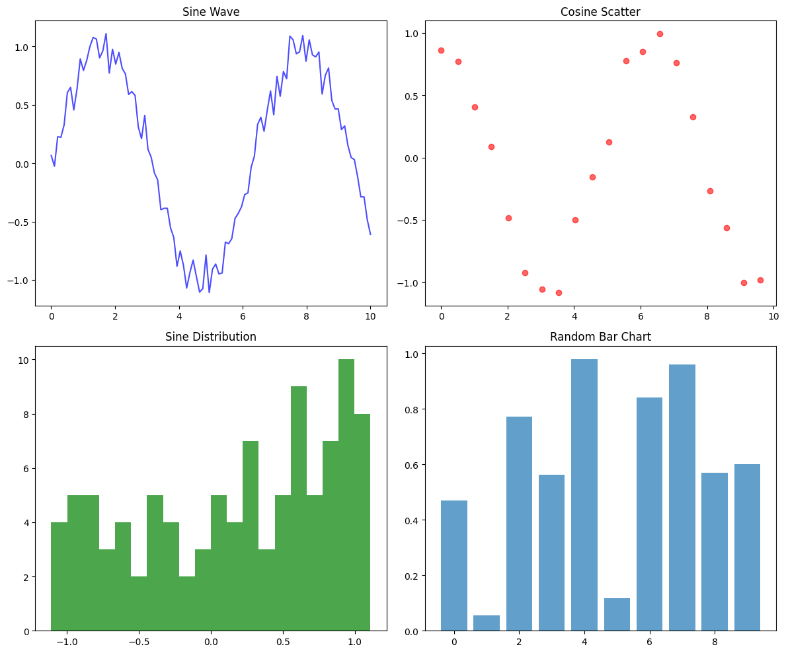

# Getting Started with LLM Sandbox

This guide will help you get up and running with LLM Sandbox in just a few minutes.

## Prerequisites

Before you begin, ensure you have:

- **Python 3.10 or higher** installed
- **Container runtime** (at least one of the following):
    - Docker Desktop or Docker Engine
    - Kubernetes cluster (local or remote)
    - Podman

## Installation

### Basic Installation

Install the core package:

```bash
pip install llm-sandbox
```

### Backend-Specific Installation

Install with support for specific backends:

```bash
# Docker backend (most common)
pip install 'llm-sandbox[docker]'

# Kubernetes backend
pip install 'llm-sandbox[k8s]'

# Podman backend
pip install 'llm-sandbox[podman]'

# All backends
pip install 'llm-sandbox[docker,k8s,podman]'
```

### Development Installation

For contributing or development:

```bash
git clone https://github.com/vndee/llm-sandbox.git
cd llm-sandbox
pip install -e '.[dev]'
```

## Quick Start

### Your First Sandbox Session

Let's run a simple Python code in a sandbox:

```python
from llm_sandbox import SandboxSession

# Create and use a sandbox session
with SandboxSession(lang="python") as session:
    result = session.run("""
print("Hello from LLM Sandbox!")
print("I'm running in a secure container.")
    """)

    print(result.stdout)
```

Output:
```
Hello from LLM Sandbox!
I'm running in a secure container.
```

### Installing Libraries

Install and use Python packages dynamically:

```python
from llm_sandbox import SandboxSession

with SandboxSession(lang="python") as session:
    # Run code with numpy
    result = session.run("""
import numpy as np

# Create an array
arr = np.array([1, 2, 3, 4, 5])
print(f"Array: {arr}")
print(f"Mean: {np.mean(arr)}")
print(f"Sum: {np.sum(arr)}")
    """, libraries=["numpy"])

    print(result.stdout)
```

Output:
```
Array: [1 2 3 4 5]
Mean: 3.0
Sum: 15
```

### Working with Different Languages

LLM Sandbox supports multiple programming languages:

#### JavaScript Example

```python
with SandboxSession(lang="javascript") as session:
    result = session.run("""
const greeting = "Hello from Node.js!";
console.log(greeting);

// Using a library
const axios = require('axios');
console.log("Axios loaded successfully!");
    """, libraries=["axios"])

    print(result.stdout)
```

Output:
```
Hello from Node.js!
Axios loaded successfully!
```

#### Java Example

```python
with SandboxSession(lang="java") as session:
    result = session.run("""
public class HelloWorld {
    public static void main(String[] args) {
        System.out.println("Hello from Java!");

        // Print Java version
        String version = System.getProperty("java.version");
        System.out.println("Java version: " + version);
    }
}
    """)

    print(result.stdout)
```

Output:
```
Hello from Java!
Java version: 17.0.1
```

#### C++ Example

```python
with SandboxSession(lang="cpp") as session:
    result = session.run("""
#include <iostream>

int main() {
    std::cout << "Hello from C++!" << std::endl;
    return 0;
}
    """)

    print(result.stdout)
```

Output:
```
Hello from C++!
```

#### Go Example

```python

with SandboxSession(lang="go") as session:
    result = session.run("""
package main
import "fmt"
func main() {
    fmt.Println("Hello from Go!")
}
    """)

    print(result.stdout)
```

Output:
```
Hello from Go!
```

### Capturing Plots and Visualizations

LLM Sandbox can automatically capture plots generated by your code by using the `ArtifactSandboxSession` class. It is currently only supported for Python code, but will be supported for other languages in the future.

```python
--8<-- "examples/python_simple_artifact.py"
```

Output:
```
Plot generated successfully!
```



### Using Different Backends

#### Docker Backend (Default)

```python
from llm_sandbox import SandboxSession, SandboxBackend

with SandboxSession(
    backend=SandboxBackend.DOCKER,
    lang="python"
) as session:
    result = session.run("print('Running on Docker!')")
    print(result.stdout)
```

#### Kubernetes Backend

```python
with SandboxSession(
    backend=SandboxBackend.KUBERNETES,
    lang="python",
    kube_namespace="default"
) as session:
    result = session.run("print('Running on Kubernetes!')")
    print(result.stdout)
```

#### Podman Backend

```python
from podman import PodmanClient

client = PodmanClient(base_url="unix:///run/podman/podman.sock")

with SandboxSession(
    backend=SandboxBackend.PODMAN,
    client=client,
    lang="python"
) as session:
    result = session.run("print('Running on Podman!')")
    print(result.stdout)
```

### Working with Files

Copy files to and from the sandbox:

```python
with SandboxSession(lang="python") as session:
    # Copy file to sandbox
    session.copy_to_runtime("local_data.csv", "/sandbox/data.csv")

    # Process the file
    result = session.run("""
import pandas as pd

# Read the CSV file
df = pd.read_csv('/sandbox/data.csv')
print(f"Shape: {df.shape}")
print(f"Columns: {list(df.columns)}")
print(f"First 5 rows:\n{df.head()}")

# Save processed data
df.to_csv('/sandbox/processed.csv', index=False)
    """, libraries=["pandas"])

    # Copy file back from sandbox
    session.copy_from_runtime("/sandbox/processed.csv", "processed_data.csv")
```

### Setting Resource Limits

Control resource usage with runtime configurations:

```python
with SandboxSession(
    lang="python",
    runtime_configs={
        "cpu_count": 2,           # Limit to 2 CPU cores
        "mem_limit": "512m",      # Limit memory to 512MB
        "timeout": 30,            # 30 second timeout
    }
) as session:
    result = session.run("""
# This will run with limited resources
import multiprocessing
print(f"Available CPUs: {multiprocessing.cpu_count()}")
    """)
    print(result.stdout)
```

### Basic Security Policies

Implement basic security checks:

```python
from llm_sandbox import SandboxSession
from llm_sandbox.security import SecurityPolicy, SecurityPattern, SecurityIssueSeverity

# Create a security policy
policy = SecurityPolicy(
    severity_threshold=SecurityIssueSeverity.MEDIUM,
    patterns=[
        SecurityPattern(
            pattern=r"os\.system",
            description="System command execution",
            severity=SecurityIssueSeverity.HIGH
        ),
        SecurityPattern(
            pattern=r"eval\s*\(",
            description="Dynamic code evaluation",
            severity=SecurityIssueSeverity.MEDIUM
        )
    ]
)

with SandboxSession(lang="python", security_policy=policy) as session:
    # Check if code is safe before running
    code = "print('This is safe code')"
    is_safe, violations = session.is_safe(code)

    if is_safe:
        result = session.run(code)
        print(result.stdout)
    else:
        print("Code failed security check:")
        for v in violations:
            print(f"  - {v.description}")
```

## Common Use Cases

### 1. LLM Code Execution

Execute code generated by an LLM safely:

Example with Langchain:
```python
--8<-- "examples/langchain_tool.py"
```

Example with Langgraph:
```python
--8<-- "examples/langgraph_tool.py"
```

Example with LlamaIndex:
```python
--8<-- "examples/llamaindex_tool.py"
```


### 2. Data Analysis Pipeline

Run data analysis safely:

```python
with SandboxSession(lang="python") as session:
    result = session.run("""
import pandas as pd
import numpy as np
import matplotlib.pyplot as plt

# Generate sample data
np.random.seed(42)
data = {
    'sales': np.random.randint(100, 1000, 50),
    'customers': np.random.randint(10, 100, 50),
    'profit_margin': np.random.uniform(0.1, 0.5, 50)
}

df = pd.DataFrame(data)

# Analysis
print("Data Summary:")
print(df.describe())
print(f"\nTotal Sales: ${df['sales'].sum():,}")
print(f"Average Profit Margin: {df['profit_margin'].mean():.2%}")

# Visualization
plt.figure(figsize=(12, 4))

plt.subplot(1, 3, 1)
plt.hist(df['sales'], bins=15, edgecolor='black')
plt.title('Sales Distribution')

plt.subplot(1, 3, 2)
plt.scatter(df['customers'], df['sales'])
plt.xlabel('Customers')
plt.ylabel('Sales')
plt.title('Sales vs Customers')

plt.subplot(1, 3, 3)
plt.boxplot(df['profit_margin'])
plt.title('Profit Margin Distribution')

plt.tight_layout()
plt.show()
    """, libraries=["pandas", "numpy", "matplotlib"])

    print(result.stdout)
```

### 3. Testing User-Submitted Code

Safely test code submitted by users:

```python
def test_user_code(code: str, test_cases: list):
    """Test user code against test cases"""
    with SandboxSession(lang="python") as session:
        # Inject test framework
        full_code = f"""
{code}

# Run test cases
test_results = []
"""

        for i, test in enumerate(test_cases):
            full_code += f"""
try:
    result = {test['call']}
    expected = {test['expected']}
    passed = result == expected
    test_results.append({{
        'test': {i},
        'passed': passed,
        'expected': expected,
        'actual': result
    }})
except Exception as e:
    test_results.append({{
        'test': {i},
        'passed': False,
        'error': str(e)
    }})
"""

        full_code += """
# Print results
for result in test_results:
    print(result)
"""

        result = session.run(full_code)
        return result.stdout

# Example usage
user_code = """
def add(a, b):
    return a + b

def multiply(a, b):
    return a * b
"""

test_cases = [
    {"call": "add(2, 3)", "expected": 5},
    {"call": "add(-1, 1)", "expected": 0},
    {"call": "multiply(3, 4)", "expected": 12},
    {"call": "multiply(0, 5)", "expected": 0},
]

print(test_user_code(user_code, test_cases))
```

## Best Practices

### 1. Always Use Context Managers

Always use the `with` statement to ensure proper cleanup:

```python
# Good ✓
with SandboxSession(lang="python") as session:
    result = session.run("print('Hello')")

# Avoid ✗
session = SandboxSession(lang="python")
session.open()
result = session.run("print('Hello')")
session.close()  # Easy to forget!
```

### 2. Handle Errors Gracefully

```python
with SandboxSession(lang="python") as session:
    try:
        result = session.run(code)
        if result.exit_code != 0:
            print(f"Error: {result.stderr}")
        else:
            print(f"Output: {result.stdout}")
    except Exception as e:
        print(f"Sandbox error: {e}")
```

### 3. Use Security Policies

Always use security policies and check if the code is safe before running it:

```python
from llm_sandbox import SandboxSession
from llm_sandbox.security import SecurityPolicy, SecurityPattern, SecurityIssueSeverity

# Create a security policy
policy = SecurityPolicy(
    severity_threshold=SecurityIssueSeverity.MEDIUM,
    patterns=[
        SecurityPattern(
            pattern=r"os\.system",
            description="System command execution",
            severity=SecurityIssueSeverity.HIGH
        ),
        SecurityPattern(
            pattern=r"eval\s*\(",
            description="Dynamic code evaluation",
            severity=SecurityIssueSeverity.MEDIUM
        )
    ]
)

with SandboxSession(lang="python", security_policy=policy) as session:
    # Check if code is safe before running
    code = "print('This is safe code')"
    is_safe, violations = session.is_safe(code)

    if is_safe:
        result = session.run(code)
        print(result.stdout)
    else:
        print("Code failed security check:")
        for v in violations:
            print(f"  - {v.description}")
```

### 4. Use Your Own Pre-built Images

You can use your own pre-built images with appropriate dependencies and environment set up by specifying the `image` parameter when creating a sandbox session. It can be useful for running code that requires specific dependencies or environment variables. Since the image is pre-built, it will be faster to run the code without the need to build the image or install dependencies.

```python
from llm_sandbox import SandboxSession

with SandboxSession(
    lang="python",
    image="ghcr.io/vndee/sandbox-python-311-bullseye"
) as session:
    result = session.run("print('Hello from my custom image!')")
    print(result.stdout)
```

## Troubleshooting

### Container Runtime Not Found

```bash
# Check Docker
docker --version

# Check Podman
podman --version

# Check Kubernetes
kubectl version
```

### Permission Errors

```python
# Run as non-root user
with SandboxSession(
    lang="python",
    runtime_configs={"user": "1000:1000"},
    workdir="/tmp/sandbox"
) as session:
    pass
```

### Import Errors

```bash
# Install backend-specific dependencies
pip install 'llm-sandbox[docker]'
```

## Next Steps

- Learn about [Configuration Options](configuration.md)
- Explore [Security Policies](security.md)
- Understand [Container Backends](backends.md)
- Check out more [Examples](examples.md)
- Read the [API Reference](api-reference.md)
