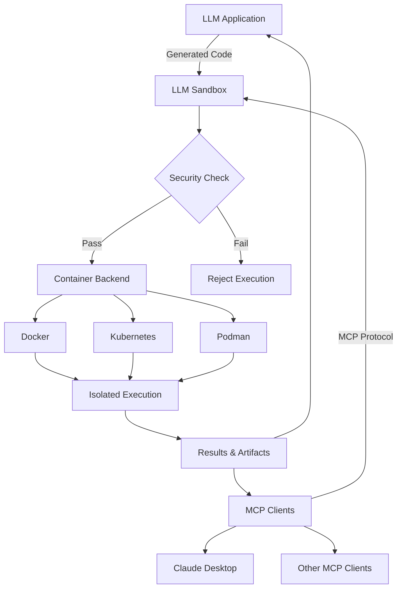

# LLM Sandbox Documentation

[](https://sonarcloud.io/summary/new_code?id=vndee_llm-sandbox)

[](https://sonarcloud.io/summary/new_code?id=vndee_llm-sandbox)
[](https://pypi.org/project/llm-sandbox/)
[](https://img.shields.io/github/v/release/vndee/llm-sandbox)
[](https://github.com/vndee/llm-sandbox/actions/workflows/main.yml?query=branch%3Amain)
[](https://www.codefactor.io/repository/github/vndee/llm-sandbox)
[](https://codecov.io/gh/vndee/llm-sandbox)


## Welcome to LLM Sandbox

**LLM Sandbox** is a lightweight and portable sandbox environment designed to run Large Language Model (LLM) generated code in a safe and isolated mode. It provides a secure execution environment for AI-generated code while offering flexibility in container backends and comprehensive language support.

<div class="grid cards" markdown>

-   :material-shield-check:{ .middle } **Secure Execution**

    ---

    Run untrusted LLM-generated code safely with customizable security policies and isolated container environments

    [:octicons-arrow-right-24: Security guide](security.md)

-   :material-rocket-launch:{ .middle } **Multiple Backends**

    ---

    Choose from Docker, Kubernetes, or Podman backends based on your infrastructure needs

    [:octicons-arrow-right-24: Backend options](backends.md)

-   :material-code-braces:{ .middle } **Multi-Language**

    ---

    Execute code in Python, JavaScript, Java, C++, and Go with automatic dependency management

    [:octicons-arrow-right-24: Language guide](languages.md)

-   :material-puzzle:{ .middle } **LLM Integration**

    ---

    Seamlessly integrate with LangChain, LangGraph, and LlamaIndex for AI-powered applications

    [:octicons-arrow-right-24: Integrations](integrations.md)

-   :material-api:{ .middle } **MCP Server**

    ---

    Model Context Protocol server for AI assistants like Claude Desktop to execute code securely

    [:octicons-arrow-right-24: MCP Integration](mcp-integration.md)

</div>

## Key Features

### 🛡️ Security First
- **Isolated Execution**: Code runs in isolated containers with no access to host system
- **Security Policies**: Define custom security policies to control code execution
- **Resource Limits**: Set CPU, memory, and execution time limits
- **Network Isolation**: Control network access for sandboxed code

### 🚀 Flexible Container Backends
- **Docker**: Most popular and widely supported option
- **Kubernetes**: Enterprise-grade orchestration for scalable deployments
- **Podman**: Rootless containers for enhanced security

### 📊 Advanced Features
- **Artifact Extraction**: Automatically capture plots and visualizations
- **Library Management**: Install dependencies on-the-fly
- **File Operations**: Copy files to/from sandbox environments
- **Custom Images**: Use your own container images
- **MCP Server**: Model Context Protocol integration for AI assistants

## Quick Example

```python
--8<-- "examples/python_simple_artifact.py"
```


## Installation

### Basic Installation
```bash
pip install llm-sandbox
```

### With Specific Backend
```bash
# For Docker support
pip install 'llm-sandbox[docker]'

# For Kubernetes support
pip install 'llm-sandbox[k8s]'

# For Podman support
pip install 'llm-sandbox[podman]'
```

## Why LLM Sandbox?

### The Challenge
As LLMs become more capable at generating code, there's an increasing need to execute this code safely. Running untrusted code poses significant security risks:

- **System compromise** through malicious commands
- **Data exfiltration** via network access
- **Resource exhaustion** from infinite loops
- **File system damage** from destructive operations

### Our Solution
LLM Sandbox provides a secure, isolated environment that:

1. **Isolates code execution** in containers
2. **Enforces security policies** before execution
3. **Limits resource usage** to prevent abuse
4. **Integrates seamlessly** with LLM frameworks

## Architecture Overview



## Getting Started

Ready to start using LLM Sandbox? Check out our [Getting Started Guide](getting-started.md) for detailed setup instructions and your first sandbox session.

## Documentation Overview

- **[Getting Started](getting-started.md)** - Installation and basic usage
- **[Configuration](configuration.md)** - Detailed configuration options
- **[Security](security.md)** - Security policies and best practices
- **[Backends](backends.md)** - Container backend details
- **[Languages](languages.md)** - Supported programming languages
- **[Integrations](integrations.md)** - LLM framework integrations
- **[MCP Integration](mcp-integration.md)** - Model Context Protocol server setup and usage
- **[Existing Container Support](existing-container-support.md)** - Connecting to existing containers/pods
- **[API Reference](api-reference.md)** - Complete API documentation
- **[Examples](examples.md)** - Real-world usage examples

## Community & Support

- **GitHub**: [github.com/vndee/llm-sandbox](https://github.com/vndee/llm-sandbox)
- **Issues**: [Report bugs or request features](https://github.com/vndee/llm-sandbox/issues)
- **Discussions**: [Join the community](https://github.com/vndee/llm-sandbox/discussions)
- **PyPI**: [pypi.org/project/llm-sandbox](https://pypi.org/project/llm-sandbox/)

## License

LLM Sandbox is open source software licensed under the MIT License. See the [LICENSE](https://github.com/vndee/llm-sandbox/blob/main/LICENSE) file for details.
